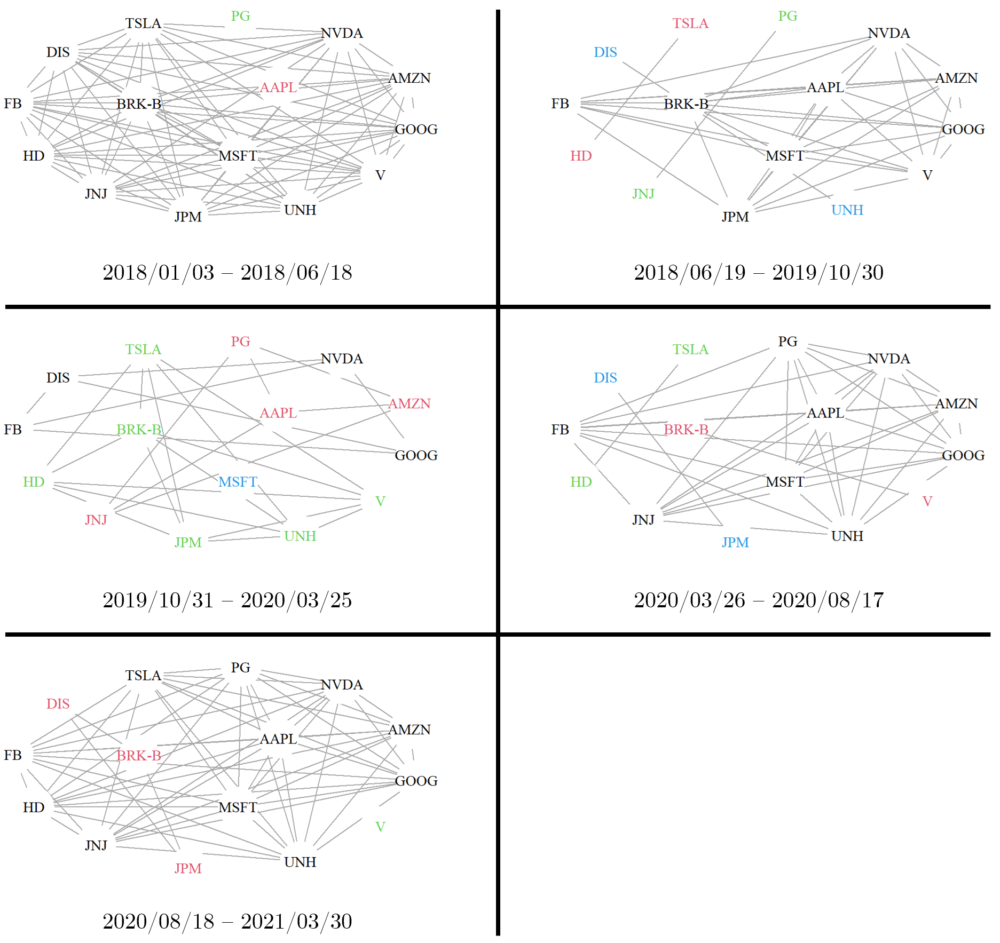
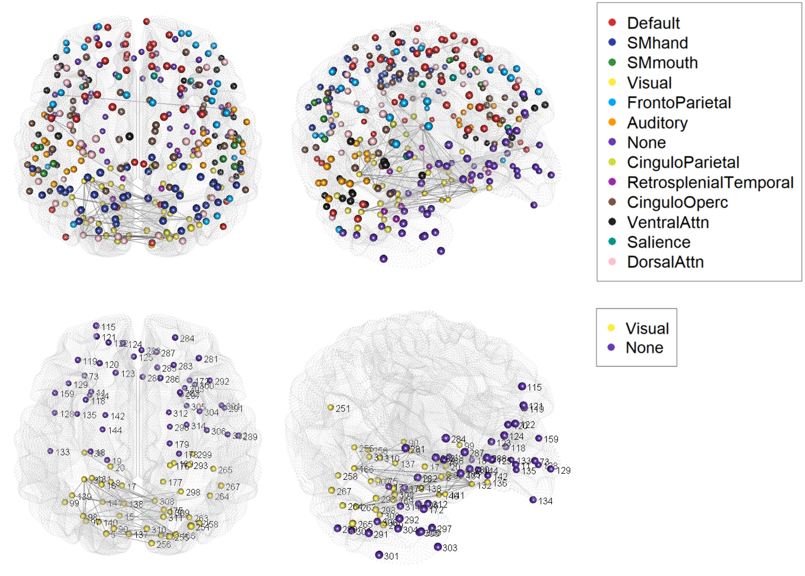
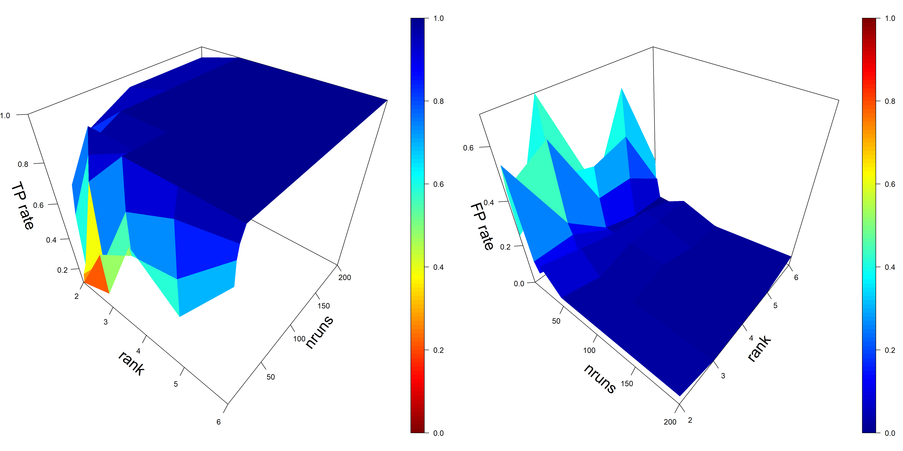

# fabisearch package experiments

For more information, and to cite this work:

```
@article{ondrus2024fabisearch,
  title={fabisearch: A package for change point detection in and visualization of the network structure of multivariate high-dimensional time series in R},
  author={Ondrus, Martin and Cribben, Ivor},
  journal={Neurocomputing},
  volume={578},
  pages={127321},
  year={2024},
  publisher={Elsevier}
}
```

## SP500 analysis

We detect change points for financial data on SP500 daily log returns, and find change points are concentrated around key economic events, such as the 2007-2008 financial crisis.



## Resting-state fMRI data

We look at the [NYU CSC test-retest dataset](https://www.nitrc.org/projects/nyu_trt), and observe a large concentration of lateralization of edges, and dense connections in the visual community. Brain networks are plotted by the `net.3dplot()` function in the `fabisearch` package. 



## Hyperparameter tuning

Our sensitivity analysis suggests that hyperparameters `nruns` and `rank` need to be sufficiently large enough to ensure accurate change point detection, and after this there are diminishing marginal returns.

